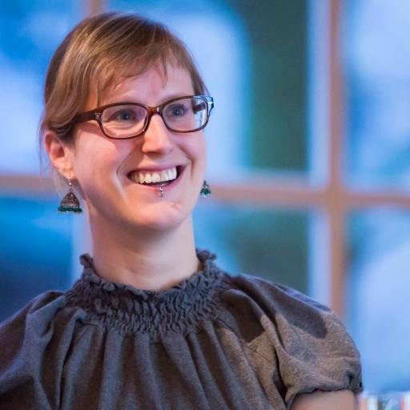

### Felienne Hermans

Felienne is assistant professor at Delft University of Technology, where she makes programming for non-programmers more awesome. She built an IDE for spreadsheets in the form of smell detection, refactoring and unit testing tools for Excel, and she has researched code smells and clone detection in the Scratch programming language for kids.

On Saturdays' she volunteers at a local community center to teach children programming with Scratch, HTML and JavaScript, and she is one of the founders of Joy of Coding, a one day developer conference in Rotterdam that celebrates the love for programming. 

### How kids code: an analysis of 250.000 Scratch programs
Scratch is an amazingly popular programming language for kids, with 14 million public programs available in their online repository. But, what do kids do in their programs? Are their programs simple or complex? Do they apply programming concepts or do they just play with the blocks? Do kids develop good programming habits? Are there common code patterns?

To answer those questions, we scraped the Scratch repository, retrieved 250,000 projects and performed source code analysis on them.

In this talk, you will learn about:

Scratch programming, in case you want to teach kids (or play yourself :))
Our methods for scraping and analyzing 250k programs
The answers to all research questions above, including whether kids make 'smelly' programs (spoiler alert: yes!)
We will also discuss the lessons learned and showcase some extreme cases we found in the Scratch repository.

