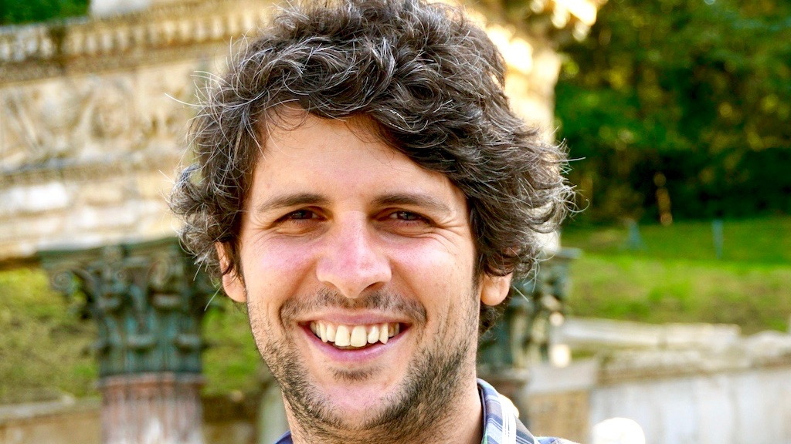

### Mircea Filip Lungu

Mircea Lungu is assistant professor in Software Engineering in the Computer Science Department of the Johann Bernoulli Institute of the Faculty of Mathematics and Natural Sciences of University of Groningen. He is a member of the SEARCH research group and also a member of the DSSC pioneers, a group of researchers focusing on using data science in interdisciplinary research projects. Before coming to the Netherlands he was a senior researcher at the University of Bern, a visting researcher at IBM TJ Watson Research center, and a PhD student at the University of Lugano, in Switzerland. 

### The Essentiality of Context in Software Analytics
The poet John Donne once said: “No man is an island entire of itself; every man is a piece of the continent, a part of the main”. 
Software systems are also impossible to be thought of entire of themselves. Instead, systems exist and evolve in broader ecosystems in which they are interdependent on each other. Within these ecosystems software developers, intentionally or not, unbeknowst to them or not, influence and are being influenced by other software developers.

In software engineering in general and in software analytics in particular, we must thus learn to embrace this interdependency and make it work for us. 

In this talk I will present some of the opportunities that come with analyzing software systems in the context of their evolving ecosystem. I will show how by taking the context into account we can better understand our systems and we can better design the working environments for the ever increasing number of people who are joining the software engineering profession. 
