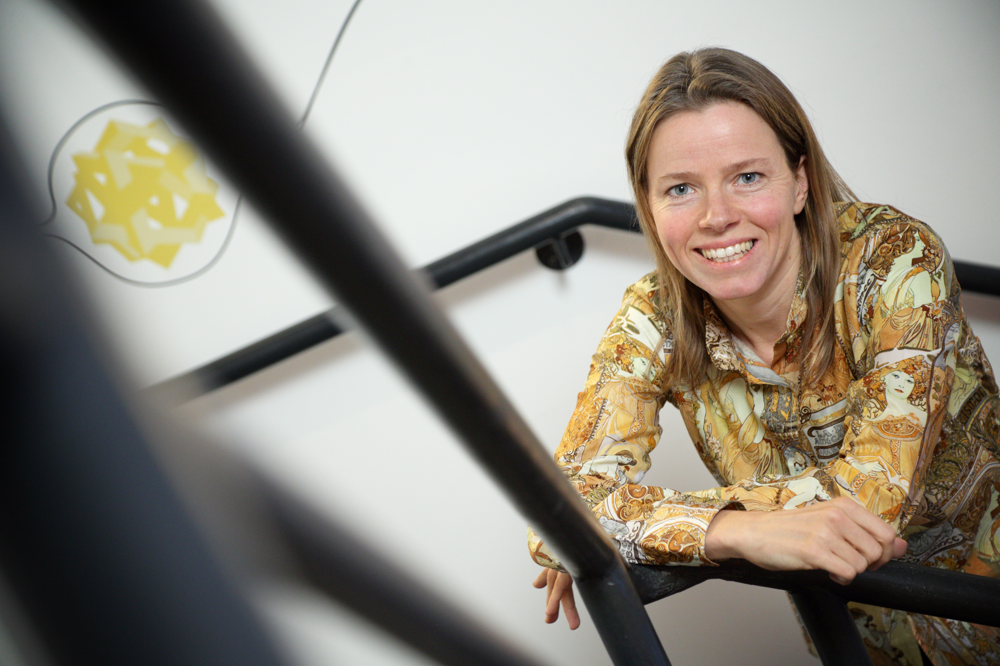

### Mariëlle Stoelinga 

Dr. Mariëlle Stoelinga is a associate professor at the University of Twente, the Netherlands, where she leads a team on quantitative analysis and risk management of software systems. Her research interests include fault tree analysis, model-based testing and stochastic model checking. Dr. Stoelinga holds an MSc and PhD degree from Radboud University Nijmegen, the Netherlands, and has spent several years as a post-doc at the University of California at Santa Cruz, USA. 

###How risk happens, and stochastic model checking can help.
How do we ensure that self-driving cars, nuclear power plants and Internet-of-things devices are safe and reliable? That is the topic of risk management. Fault tree analysis is a very popular technique here, deployed by many institutions like NASA, ESA, Honeywell, Airbus, the FDA, Toyota, Shell etc.

In this presentation, I will elaborate how the deployment of stochastic model checking can improve the capabilities of fault tree analysis, making them more powerful, flexible and efficient, allowing one to analyze a richer variety of questions faster.

One crucial element in reliability engineering is maintenance. Maintenance reduced the number of failures and extends a system's life time. At the same time, maintenance is expensive, as it requires specialized personnel and equipment. As such, maintenance is a multi-objective optimization problem, trading of (planned / unplanned) downtime, and several cost parameters.

Finally, I will report on our experience with the application and validation of these techniques in industrial practice; in particular in the railroad and nuclear domain. 

